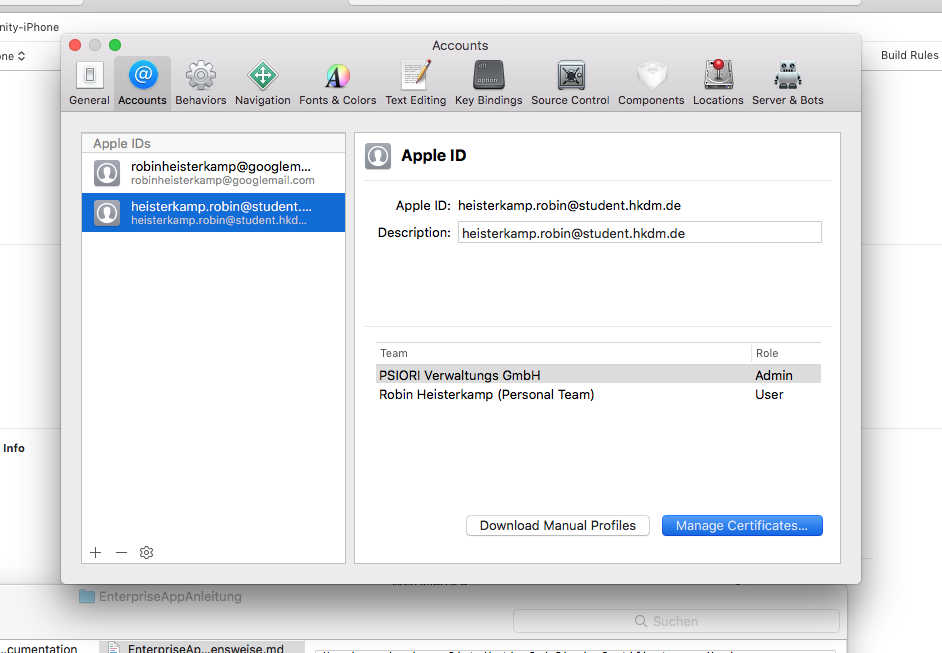

# Anleitung zur Erstellung einer Enterprise App

### 1.Vorraussetzungen
Um eine App mithilfe von Xcode für Enterprise oder AdHoc Distribution zu builden benötigt man ein DistributionCodesigningCertificate, ein ProvisioningProfile und eine AppId.

Die AppId kann man im Enterprise Portal unter Certificates IDs & Profiles>App IDs anlegen.

Ein DistributionCodesigningCertificate kann in Xcode erstellt werden. Wenn bereits ein DistributionCodesigningCertificate vorhanden ist sollte es aber verwendet werden.
Um ein vorhandenes DistributionCodesigningCertificate von Xcode zu exportieren kann man in Xcode unter Xcode >Preferences>Accounts den Account auswählen, der mit dem Enterprise Programm verbunden ist.

Im Anschluss kann man unter „Manage Certificates" mit der rechten Maustaste auf das Certificate klicken und es mit Passwort exportieren. Xcode erstellt darauf hin eine neue Datei, die das Certificate enthält.
Um das Certificate auf einem neuen Rechner zu installieren kann man die Datei einfach doppelt anklicken.

Das ProvisioningProfile kann ebenfalls im Enterprise Portal erstellt werden.
Dazu unter Certificates IDs & Profiles>All>+
Es ist auch möglich, ein ProvisioningProfile für mehrere Apps zu verwenden.

### 2.Builden der App
Wenn ProvisioningProfile, CodesigningCertificate und App ID bereit sind kann die App in Xcode für Enterprise oder AdHoc Distribution gebuilded werden.
Dazu zunächst das Xcode Projekt öffnen und dann archivieren: Product> Archive.

Im Anschluss können die archivierten Projekte unter Window>Organizer angezeigt werden.

Um ein Projekt zu builden klickt man nun im Organizer auf „Distribute App“ oder „Export“ (je nach Xcode Version).

Die App kann für AdHoc oder Enterprise Distribution gebuildet werden.
Der Unterschied besteht darin, dass AdHoc Apps nur auf bestimmten Geräten installiert werden dürfen, die man vorher im ProvisioningProfile festlegt.

Im nächsten Schritt wählt man den Punkt „Include Manifest for over-the-air installation“ aus und und klickt auf Next.

Nun muss man drei URLs angeben: Eine für die APP und zwei für Icons.
Hier ist es sinnvoll, zunächst Platzhalter URLs anzugeben.

Im nächsten schritt wählt man den Punkt „Manually manage signing an“ und wählt dann sein CodeSigningCertificate und Provisionning Profile aus.

Nun wird die App für IOS gebuilded .
Als Resultat erhält man einen Ordner, der unter anderem eine Projektname.ipa Datei und eine manifest.plist Datei enthält.
Die Projektname.ipa Datei enthält die kompilierte App, während die manifest.plist Datei Informationen über die App inklusive eines Downloadlinks enthält.

### Over-the-air Installation mit Dropbox
Der Inhalt der manifest.plist Datei sollte folgendermaßen strukturiert sein:

<?xml version="1.0" encoding="UTF-8"?>
<!DOCTYPE plist PUBLIC "-//Apple//DTD PLIST 1.0//EN" "http://www.apple.com/DTDs/PropertyList-1.0.dtd">
<plist version="1.0">
<dict>
	<key>items</key>
	<array>
		<dict>
			<key>assets</key>
			<array>
				<dict>
					<key>kind</key>
					<string>software-package</string>
					<key>url</key>
					<string>https://AppDownloaduUrl</string>
				</dict>
			</array>
			<key>metadata</key>
			<dict>
				<key>bundle-identifier</key>
				<string>com.psiori.appname</string>
				<key>bundle-version</key>
				<string>1.0</string>
				<key>kind</key>
				<string>software</string>
				<key>title</key>
				<string>AppName</string>
			</dict>
		</dict>
	</array>
</dict>
</plist>

Hier finden sich auch die Platzhalter URLs, die wir fürs exportieren angegeben haben.
Neben der URL für die App befinden sich auch noch die URLs für die beiden Icons in der Datei.
Diese kann man aus der manifest.plist Datei löschen.

Um die App nun over-the-air zu installieren lädt man zunächst die Projektname.ipa Datei auf dropbox hoch.
Im nächsten Schritt klickt man auf "Freigeben" und kopiert die download URL zu der Datei, die in etwa so aussieht:
https://www.dropbox.com/s/tzd4x54flk69aiz/Projektname.ipa?dl=0
Nun muss man die URL verändern, sodass sie so aussieht:
https://dl.dropboxusercontent.com/s/tzd4x54flk69aiz/Projektname.ipa

Die veränderte URL fügt man nun in die manifest.plist Datei, unter der AppDownloadURL ein. 
Als nächstes lädt man auch die manifest.plist Datei auf die DropBox hoch.
Auch hier kopiert man die download URL und verändert sie, wie zuvor die URL der .ipa Datei.

Zu Letzt benötigt man noch eine html Datei, in der ein Link auf die manifest.plist verweist.
Der Link sieht volgendermaßen aus:
itms-services://?action=download-manifest&url=https://dl.dropboxusercontent.com/s/m8xalvzxqv73eqe/manifest.plist

Öffnet man nun auf einem IOS Gerät die html Datei und klickt auf den Link wird die App installiert.
